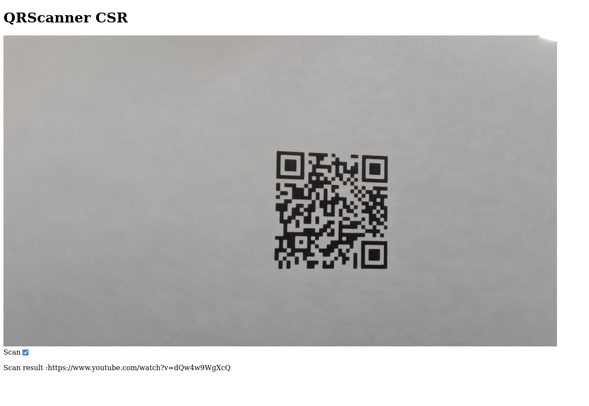

# `leptos-qr-scanner`

This crate provides a simple QR scanner component based on the [`qr-scanner` JavaScript library](https://github.com/nimiq/qr-scanner).

See the [CSR](examples/CSR/README.md) and [SSR](examples/SSR/README.md) examples for more information on how to use it.

